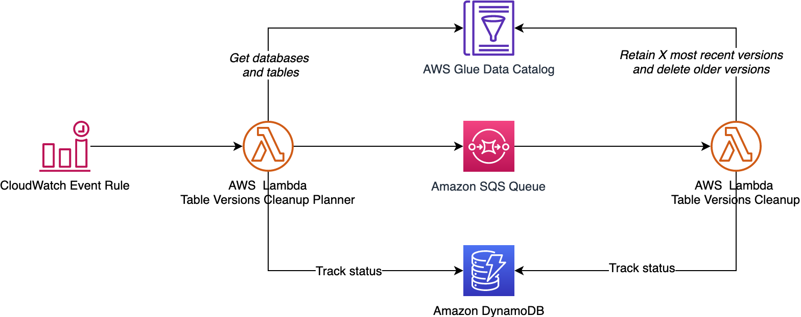

# AWS Glue Table versions cleanup utility

AWS Glue has soft limits for **Number of table versions per table** and  **Number of table versions per account**. For more details on the soft-limits, refer [AWS Glue endpoints and quotas](https://docs.aws.amazon.com/general/latest/gr/glue.html). AWS Glue Table versions cleanup utility helps you delete old versions of Glue Tables. This is developed using AWS Glue SDK for Java. This is deployed as two AWS Lambda functions. This helps you retain X number of most recent versions for each Table and deletes the rest. Using this utility, you will be able to keep per-table and account level soft-limits under control. This can be scheduled using Amazon CloudWatch Events e.g. once in a month.

This utility comes in two forms:

  1. Java - use the [main](https://github.com/aws-samples/aws-glue-table-versions-cleanup-utility/tree/main) branch
  1. Python - use [main-python](https://github.com/aws-samples/aws-glue-table-versions-cleanup-utility/tree/main-python) branch

Note: This utility safely ignores Databases and Tables that are resource linked from an another AWS account to the AWS account this utility is deployed into. In other words, this utility cleans up old versions of a table ONLY when the table belongs to the account this utility is deployed to run. Refer [How Resource Links Work in Lake Formation](https://docs.aws.amazon.com/lake-formation/latest/dg/resource-links-about.html) for more details.

---

## Architecture

The Architecture of this utility is shown in the below diagram


---

## Application Overview

### Pre-requisites

 1. JDK 8
 1. IDE for  e.g. [Eclipse](https://www.eclipse.org/) or [Spring Tools](https://spring.io/tools) or [Intellij IDEA](https://www.jetbrains.com/idea/)
 1. [Apache Maven](https://maven.apache.org/)
 1. Access to AWS account
 1. [AWS CLI](https://docs.aws.amazon.com/cli/latest/userguide/install-cliv2.html)

---

### AWS Service Requirements

The following AWS services are required to deploy this utility:

  1. 2 AWS Lambda functions
  1. 2 IAM roles
  1. 1 Amazon SQS Queue
  1. 2 Amazon DynamoDB tables
  1. 1 AWS CloudWatch Event Rule
  1. 1 Amazon S3 bucket to upload AWS Lambda Function binary

### Lambda Functions Overview

| Class     | Overview |
|---------- | -------- |
| [TableVersionsCleanupPlannerLambda](./src/main/java/software/aws/glue/tableversions/lambda/TableVersionsCleanupPlannerLambda.java) | Lambda Function gets a list of tables for all databases and initiates the cleanup process.|
| [TableVersionsCleanupLambda](./src/main/java/software/aws/glue/tableversions/lambda/TableVersionsCleanupLambda.java) | Lambda Function deletes old versions of a table. |

 ---

## Build Instructions

1. Clone this code repo to your Laptop / MacBook
1. This project has Maven nature, so you can import it to your IDE.
1. Build a Jar file using one of the steps below:
    1. Using standalone Maven, go to project home directory and run command ```mvn -X clean install```
    1. From Eclipse or STS, run command ```-X clean install```. Navigation: Project right click --> Run As --> Maven Build (Option 4)
1. This will generate a jar file  ```glue-tableversions-cleanup-0.1.jar```
1. Note: The size  of the jar file is around 16 MB

---

## Deployment Instructions

1. Log onto AWS console, select S3, select a bucket you want to use. If you do not have bucket already create one
1. Create a folder with name ```table_version_cleanup_lambda_jar```
1. Open command prompt on your Laptop / MacBook
1. Upload Lambda function Jar file to S3 bucket

    ```bash
    aws s3 cp glue-tableversions-cleanup-0.1.jar s3://<bucket_name>/table_version_cleanup_lambda_jar/
    ```

1. Create an Amazon SQS queue with the below details:
   1. name = ```table_versions_cleanup_planner_queue.fifo```
   1. Type = FIFO
   1. Configuration:
      1. Visibility timeout = 15 minutes
      1. Message retention period = 4 Days
      1. Delivery delay = 0 seconds
      1. Content-based deduplication = enable

1. Create DynamoDB tables

   | Table        | Schema |  Capacity |
   |--------------|--------|-----------|
   | glue_table_version_cleanup_planner | Primary partition key - execution_batch_id (Number), Primary sort key - database_name_table_name (String) | Provisioned read capacity units = 5, Provisioned write capacity units = 10 |
   | glue_table_version_cleanup_statistics | Primary partition key - execution_id (Number), Primary sort key - execution_batch_id (Number) | Provisioned read capacity units = 5, Provisioned write capacity units = 10 |

1. Create IAM policies that are common to both Lambda functions
   1. Amazon DynamoDB policy
      1. name = ```table_versions_cleanup_lambda_dynamodb_policy```
      1. sample policy = [table_versions_cleanup_lambda_dynamodb_policy](./src/main/resources/table_versions_cleanup_lambda_dynamodb_policy.json)
   1. Amazon CloudWatch policy
      1. name = ```table_versions_cleanup_lambda_cloudwatch_policy```
      1. sample policy = [table_versions_cleanup_cloudwatch_logs_policy](./src/main/resources/table_versions_cleanup_cloudwatch_logs_policy.json)

1. Create IAM policies for **TableVersionsCleanupPlannerLambdaExecRole**

   1. AWS Glue policy
      1. name = ```table_versions_cleanup_planner_lambda_glue_policy```
      1. sample policy = [table_versions_cleanup_planner_lambda_glue_policy](./src/main/resources/table_versions_cleanup_planner_lambda_glue_policy.json)
   1. Amazon SQS policy
      1. name = ```table_versions_cleanup_planner_lambda_sqs_policy```
      1. sample policy = [table_versions_cleanup_planner_lambda_sqs_policy](./src/main/resources/table_versions_cleanup_planner_lambda_sqs_policy.json)

1. Create IAM policies for **TableVersionsCleanupLambdaExecRole**

   1. AWS Glue policy
      1. name = ```table_versions_cleanup_lambda_glue_policy```
      1. sample policy = [table_versions_cleanup_lambda_glue_policy](./src/main/resources/table_versions_cleanup_lambda_glue_policy.json)
   1. Amazon SQS policy
      1. name = ```table_versions_cleanup_lambda_sqs_policy```
      1. sample policy = [table_versions_cleanup_lambda_sqs_policy](./src/main/resources/table_versions_cleanup_lambda_sqs_policy.json)

1. Create an IAM role with name ```TableVersionsCleanupPlannerLambdaExecRole``` and attach below policies:
   1. table_versions_cleanup_lambda_dynamodb_policy
   1. table_versions_cleanup_lambda_cloudwatch_policy
   1. table_versions_cleanup_planner_lambda_sqs_policy
   1. table_versions_cleanup_planner_lambda_glue_policy

1. Create an IAM role with name ```TableVersionsCleanupLambdaExecRole``` and attach below policies:
   1. table_versions_cleanup_lambda_sqs_policy
   1. table_versions_cleanup_lambda_glue_policy
   1. table_versions_cleanup_lambda_dynamodb_policy
   1. table_versions_cleanup_lambda_cloudwatch_policy

1. Deploy **TableVersionsCleanupPlannerLambda** function
  
   1. Runtime = Java 8
   1. IAM Execution role = ```TableVersionsCleanupPlannerLambdaExecRole```
   1. Function package = ```s3://<bucket_name>/table_version_cleanup_lambda_jar/glue-tableversions-cleanup-0.1.jar```
   1. Lambda Handler = ```software.aws.glue.tableversions.lambda.TableVersionsCleanupPlannerLambda```
   1. Timeout = e.g. 15 minutes
   1. Memory = e.g. 128 MB
   1. Environment variable = as defined in the following table

      | Variable Name  | E.g. Value   | Description  |
      |----------------|------------  | -------------|
      | database_names_string_literal | database_1$database_2$database_3  | database names string literal separated by a separator token |
      | separator | $ | The separator used in the database_prefix_list  |
      | region | us-east-1 | AWS region used |
      | sqs_queue_url | ```https://sqs.us-east-1.amazonaws.com/<AccountId>/table_versions_cleanup_planner_queue.fifo``` | SQS queue name used |
      | ddb_table_name | glue_table_version_cleanup_planner | DynamoDB Table used |
      | hash_key | execution_batch_id | Primary partition key used |
      | range_key | database_name_table_name | Primary sort key used |

1. Deploy **TableVersionsCleanupLambda** function

   1. Runtime = Java 8
   1. IAM Execution role = ```TableVersionsCleanupPlannerLambdaExecRole```
   1. Function package = ```s3://<bucket_name>/table_version_cleanup_lambda_jar/glue-tableversions-cleanup-0.1.jar```
   1. Lambda Handler = ```software.aws.glue.tableversions.lambda.TableVersionsCleanupLambda```
   1. Timeout = e.g. 15 minutes
   1. Memory = e.g. 192 MB
   1. Environment variable = as defined in the following table

      | Variable Name  | E.g. Variable Value    | Description  |
      |----------------|------------  | ------------------|
      | region | us-east-1 | AWS region used |
      | number_of_versions_to_retain | 100 | Number of old versions to retain per table |
      | ddb_table_name | glue_table_version_cleanup_statistics | DynamoDB Table used |
      | hash_key | execution_id  | Primary partition key used |
      | range_key | execution_batch_id | Primary sort key used |

   1. Add an SQS trigger and select ```table_versions_cleanup_planner_queue.fifo```

1. Create a CloudWatch Event Rule and add **TableVersionsCleanupPlannerLambda** as its target.
Refer the following AWS documentation for more details:

    1. [Schedule Expressions for Rules](https://docs.aws.amazon.com/AmazonCloudWatch/latest/events/ScheduledEvents.html)
    1. [Tutorial: Schedule AWS Lambda Functions Using CloudWatch Events](https://docs.aws.amazon.com/AmazonCloudWatch/latest/events/RunLambdaSchedule.html)

---

## Contributors

1. Ravi Itha, Senior Big Data Consultant, Amazon Web Services, Inc.
1. Phanee Gottumukkala, Associate Cloud Developer, Amazon Web Services, Inc.
1. Julia Kroll, Data & ML Engineer, Amazon Web Services, Inc.

---

## License Summary

This sample code is made available under the MIT license. See the LICENSE file.
